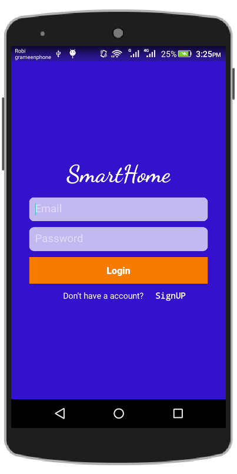
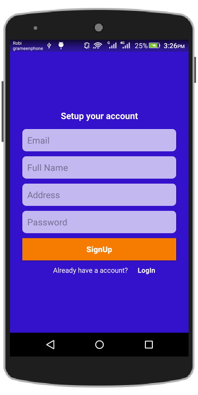
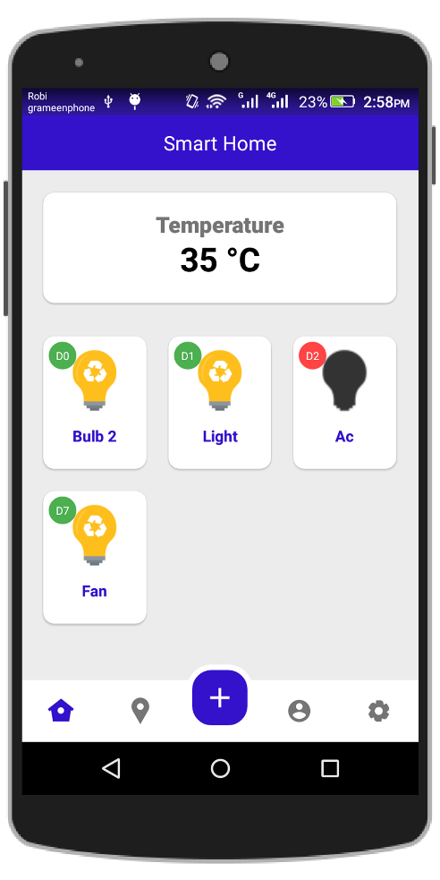
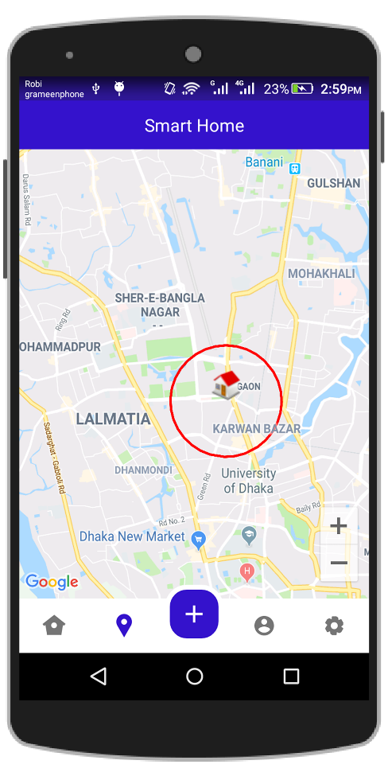
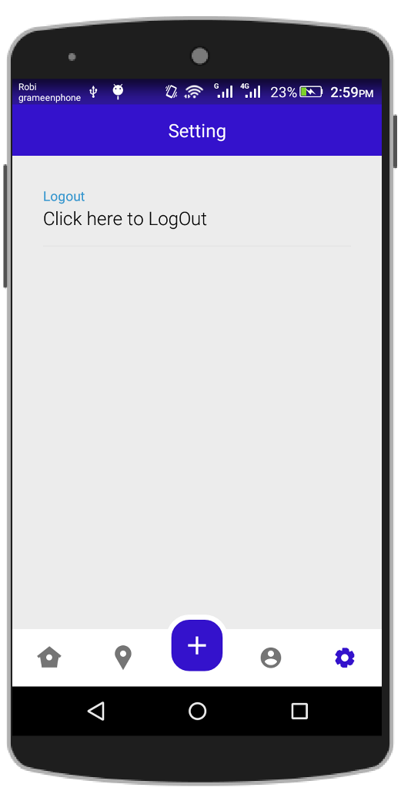
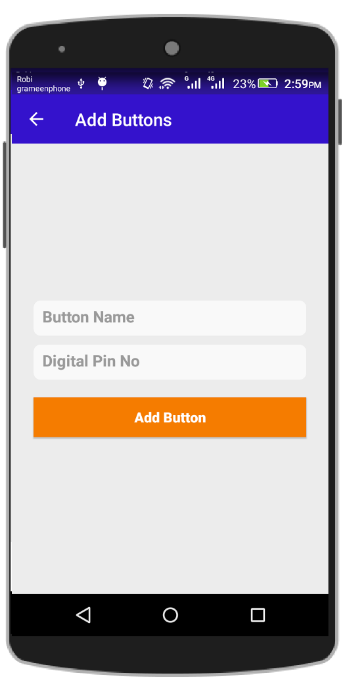

# Intelligent-Home-Automation-System-with-IOT
This project presents Internet of Things based smart home, monitoring and controlling of the home devices by using Android Applications

### 1. Login page

   
   
### 2. Registration page

   
   
### 3. Home page

   
   
### 4. Location Tracker (tracks the home location and automatically sends instruction to home devices)

   
   
### 5. Profile page

   
   
### 6. Settings

   
   
### 7. Add Buttons

   
   
### 8. Cuircit Design

    
   
   
### 9. Demo

   
   
   
   
   
   
   
   
   
   
   
   
   
   
